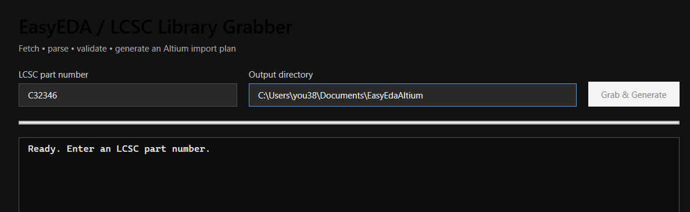
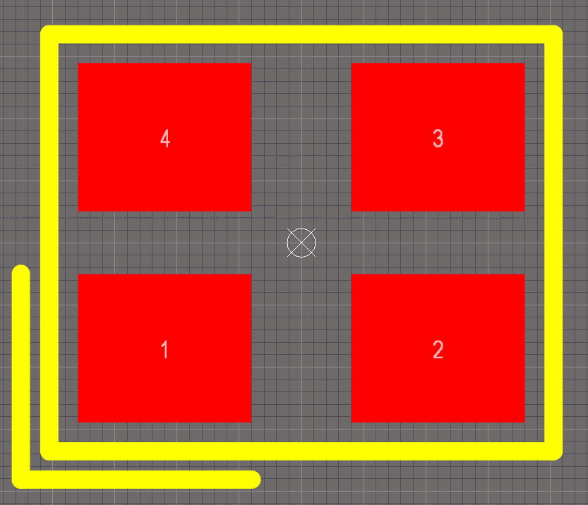

# YouEDA

YouEDA is a Windows desktop component loader for EasyEDA/LCSC parts. Enter one LCSC code or paste/import a batch, inspect the symbol and footprint preview, then choose **Altium**, **KiCad**, or **Both** in the export-format selector.

## Download version 1.0.0

The [v1.0.0 release](https://github.com/youprint/YouEDA/releases/tag/v1.0.0) currently has source archives but no attached executable. For now, build and publish from source using the commands below. Install the [.NET 10 Desktop Runtime](https://dotnet.microsoft.com/download/dotnet/10.0) on the target Windows 10/11 computer, then copy the entire published folder and run `YouEDA.exe`. Keep the DLLs, templates, and bundled symbol catalog alongside the executable. The .NET 10 SDK is needed only to build from source.

Version 1.0.0 adds native KiCad symbol/footprint export, improves drilled and slotted Altium pads, and fixes the dark-theme result-row contrast and bottom export controls. The KiCad exporter does not yet translate every EasyEDA primitive; review the [current limitations](#kicad-exporter-smoke-test) and validate each generated part against its datasheet.

Altium output uses two native shared libraries:

- `youeda.PcbLib` — footprint, copper pads, silkscreen, and embedded STEP model when EasyEDA supplies one.
- `youeda.SchLib` — schematic symbol selected from the bundled common-symbol catalog, or generated from EasyEDA pin records for IC/MCU-class parts.

Each Altium footprint is named from EasyEDA's `packageDetail.title` (falling back to the LCSC number if no title is supplied), and the schematic symbol's native `PCBLIB` model link uses that same name. The schematic library uses a light sheet background and visible designator/comment labels; resistors and capacitors store the EasyEDA value as a hidden `Value` parameter referenced by the comment, while diodes use the manufacturer part number when available. Re-import an existing part to refresh these fields and rename an older LCSC-named footprint.

For a part without a suitable bundled schematic template, the EasyEDA fallback generates a framed symbol from its pin records. Pin names sit inside the body, pin numbers outside, and the designator and comment are placed above and below the frame.

Each import **upserts** the LCSC part number in the SchLib and its EasyEDA-named footprint in the PcbLib. Multiple LCSC parts with the same EasyEDA footprint title share one PcbLib entry; re-importing one refreshes that shared footprint.

KiCad output uses `youeda.kicad_sym`, `youeda.pretty/<LCSC>.kicad_mod`, and, when available, `youeda.3dshapes/<LCSC>.step`. The output folder also gets `sym-lib-table` and `fp-lib-table` if those files do not already exist. Re-importing a part replaces its symbol and footprint without disturbing other parts. For portable 3D links, use the output folder as the KiCad project folder, or copy these files and folders together into a project folder.

> Validate every generated footprint, electrical pin mapping, and 3D model against the manufacturer datasheet before using it in production.

## Screenshots



*Part search and output workflow.*



*Example generated footprint in Altium Designer; the component outline is on Top Overlay (yellow), not a mid-layer.*

## Features

- LCSC part lookup using the public EasyEDA component payload.
- Single-code, pasted-list, and CSV/text batch input.
- Dark WPF/MVVM desktop interface with symbol and footprint previews.
- Native Altium `PcbLib` writer using [OriginalCircuit.Altium (AltiumSharp)](https://github.com/issus/AltiumSharp).
- Top/bottom copper and Top/Bottom Overlay mapping, plated and SMD pads, and embedded EasyEDA STEP 3D bodies where available.
- Native KiCad symbol, footprint, and STEP-model output with shared-library upserts, project library tables, and multi-unit EasyEDA symbol support.
- Clear selected-row text and a separate export-format selector for Altium, KiCad, or both.
- Correct EasyEDA drill-radius-to-diameter conversion for both exporters; Altium slot metadata is preserved in its native size/shape block.
- Common parts use the bundled symbol catalog (passives, diodes, crystals, connectors, sensors, transistors, LEDs, TVS/Zener, and diode arrays). IC/MCU-style parts are generated from EasyEDA pin information. Ambiguous non-IC matches open a searchable picker with side-by-side previews of the EasyEDA-pin fallback and the currently selected bundled symbol.
- **Open in Altium** launches both `youeda.PcbLib` and `youeda.SchLib` through the Windows Altium file association.

## Build from source

### Prerequisites

- Windows 10/11.
- [.NET SDK 10](https://dotnet.microsoft.com/download/dotnet/10.0).
- Git.

The Altium writer is currently referenced from the upstream source tree because the required writer package is not available as a stable NuGet package.

```powershell
git clone https://github.com/youprint/YouEDA.git
cd YouEDA
git clone https://github.com/issus/AltiumSharp.git third_party/AltiumSharp
dotnet restore .\src\EasyEdaAltiumGrabber.csproj
dotnet build .\src\EasyEdaAltiumGrabber.csproj -c Release
```

Run the development build:

```powershell
dotnet run --project .\src\EasyEdaAltiumGrabber.csproj -c Release
```

## Bulk CLI

`YouEDA.Cli` uses the same scraper, parser, 3D exporter, bundled-symbol matching, and cumulative library writers as the desktop application. It has a bulk mode designed for long catalog jobs: parallel fetch/parse workers, a global request-rate gate, raw-payload cache, one safe native-library writer, and durable checkpoint/resume state.

```powershell
dotnet run --project .\src\YouEDA.Cli\YouEDA.Cli.csproj -- --part C12345 --output C:\Libraries\YouEDA --open
dotnet run --project .\src\YouEDA.Cli\YouEDA.Cli.csproj -- --input .\parts.csv --workers 4 --rps 1 --checkpoint 100
dotnet run --project .\src\YouEDA.Cli\YouEDA.Cli.csproj -- --category resistor --catalog C:\Data\lcsc-catalog.csv --output C:\Libraries\Resistors
```

The last command selects every LCSC reference whose catalog category matches `resistor`, then resumes safely after a stop with the default `--resume` behavior. The catalog must be an official LCSC CSV/JSON export: LCSC's documented category endpoint needs an approved API key and request signature, so YouEDA does not scrape private or undocumented catalogue pages. A catalog-scale job leaves its raw cached CAD payloads, completion ledger, and failure log in `<output>\.youeda-bulk`.

`--with-3d` is deliberately opt-in for bulk jobs; downloading every STEP model adds substantial time and storage. Start conservatively (`--workers 4 --rps 1`), then raise only with authorization and after observing EasyEDA's rate-limit behavior. `--help` lists all options.

## Publish a Windows build

Create a framework-dependent folder matching the v1.0.0 release package:

```powershell
dotnet publish .\src\EasyEdaAltiumGrabber.csproj -c Release --self-contained false -o .\dist\YouEDA
```

Copy the complete `dist\YouEDA` folder to the target computer. Do not copy only `YouEDA.exe`: the DLLs, native dependencies, templates, and bundled symbols beside it are required. Install the .NET 10 Desktop Runtime on that computer.

To package the same layout as the release download:

```powershell
Compress-Archive -Path .\dist\YouEDA\* -DestinationPath .\dist\YouEDA-1.0.0-win-x64.zip -Force
```

## Install and first use

1. Extract/copy the published `YouEDA` folder to a permanent location, for example `C:\Apps\YouEDA`.
2. Run `YouEDA.exe`. Windows may show a SmartScreen warning for an unsigned local build; review the source/release and follow your organization’s policy.
3. Choose an output directory, such as `C:\Users\<you>\Documents\YouEDA-Libraries`.
4. Search an LCSC part number (`C12345`), select the footprint/3D rows to add, and choose **Add selected to library**.
5. Use **Open in Altium** to load the shared `youeda.PcbLib` and `youeda.SchLib` files in Altium Designer. If a library is already open and locked in Altium, close it before updating it in YouEDA.
6. For KiCad output, create or open a KiCad project in the output folder. KiCad reads the generated `sym-lib-table` and `fp-lib-table`; select the `youeda` library in the symbol and footprint choosers.
7. Inspect the imported footprint, symbol polarity/pin mapping, model orientation, and manufacturer datasheet before release.

## KiCad exporter smoke test

The repository includes an offline test for EasyEDA parsing, multi-unit symbols, KiCad upsert, 3D paths, Altium drilled-pad round-tripping, native schematic labels/footprint links, and rendered symbol previews for resistor, capacitor, and diode examples:

```powershell
dotnet run --project .\tests\KiCadSmoke\KiCadSmoke.csproj
```

If KiCad CLI is installed, you can also ask KiCad itself to render the generated symbol and footprint from the test's `smoke-output` folder using `kicad-cli sym export svg` and `kicad-cli fp export svg`. The desktop exporter does not require KiCad or Python at runtime. The bulk CLI remains Altium-only for now.

This first KiCad exporter handles common pads, drilled/slot pads, tracks, rectangles, circles, holes, courtyard paths, STEP references, and schematic pins/graphics. EasyEDA `ARC`, `VIA`, `TEXT`, and complex SVG curves are not yet translated; inspect those parts against the source and datasheet before use. STEP paths and placement data are written, but each 3D pose still needs visual review in KiCad.

## Bundled symbol catalog

`src\Assets\BundledUserSymbols.SchLib` is included with this repository and is copied into the application during build/publish. It provides the common-component symbols that YouEDA matches before falling back to EasyEDA-generated symbols. If you distribute a modified catalog, ensure that you have permission to redistribute its artwork and pin definitions.

```text
src\Assets\BundledUserSymbols.SchLib
```

## Third-party notices

- [OriginalCircuit.Altium / AltiumSharp](https://github.com/issus/AltiumSharp), Apache-2.0. It provides the native Altium file reader/writer used by YouEDA.
- [easyeda2kicad.py](https://github.com/uPesy/easyeda2kicad.py), AGPL-3.0, was consulted as an EasyEDA/KiCad format reference; its Python source is not bundled or copied into YouEDA.
- EasyEDA/LCSC data is fetched from public web endpoints. Endpoint formats can change without notice.

YouEDA is an independent desktop tool; it is not affiliated with Altium, EasyEDA, JLCPCB, or LCSC.
