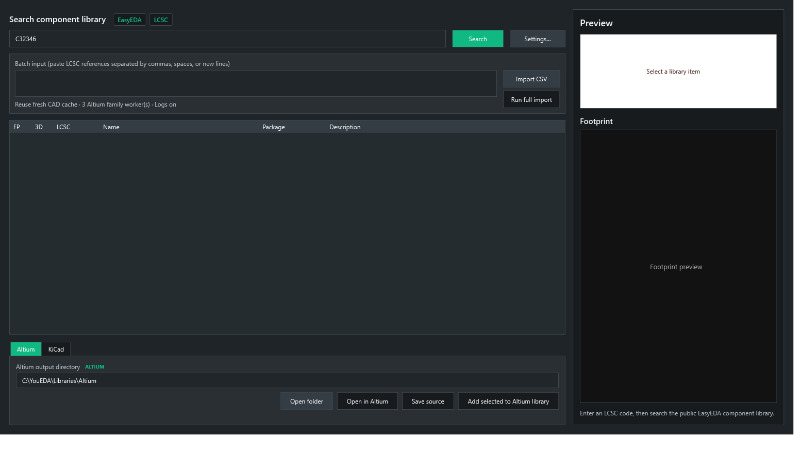
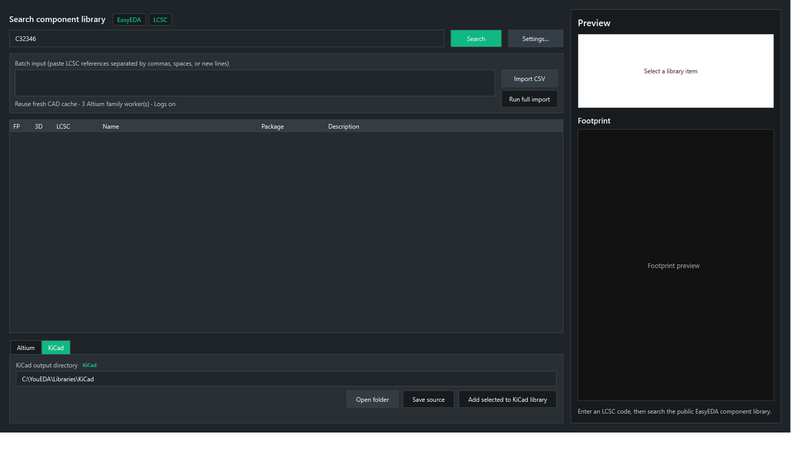
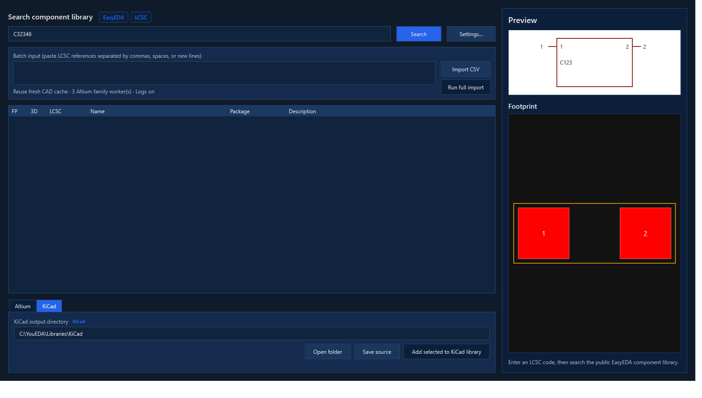
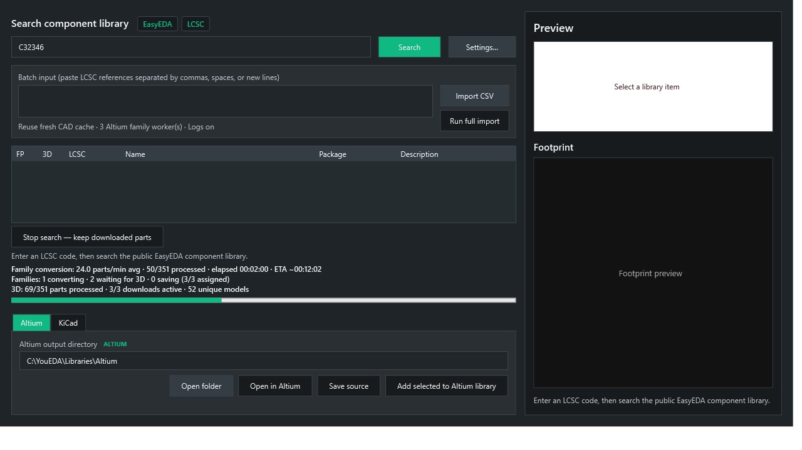
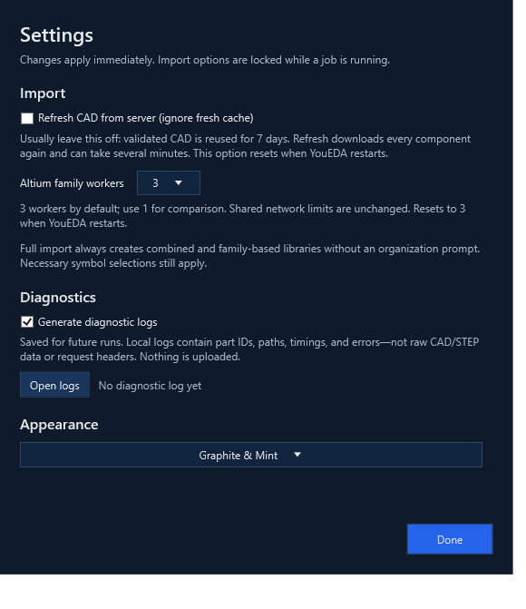
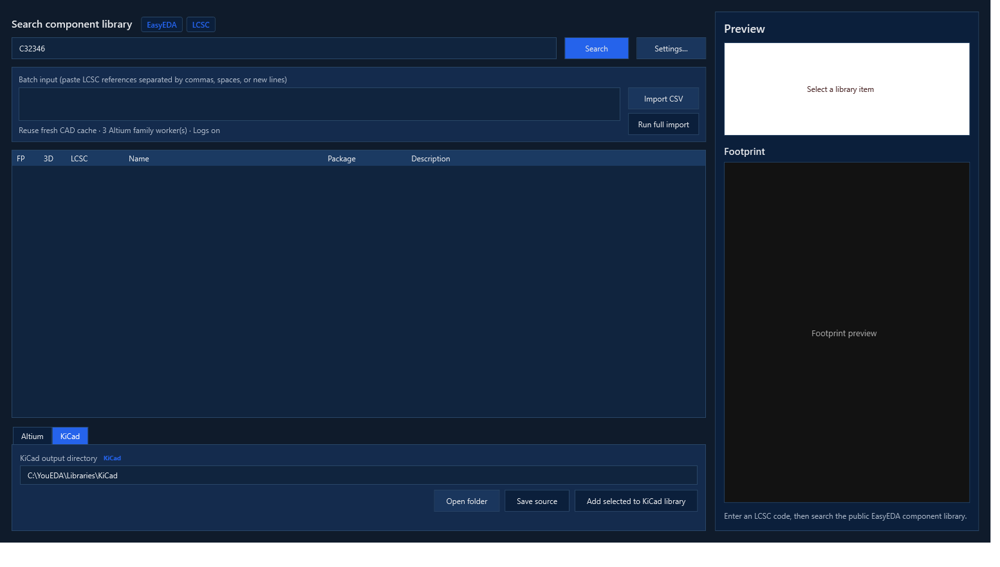
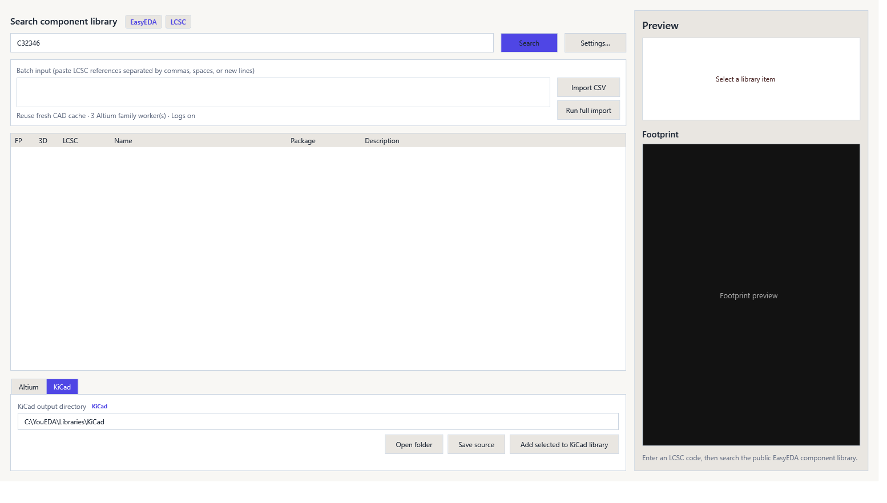
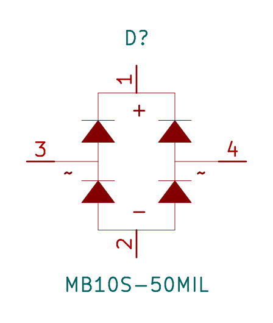
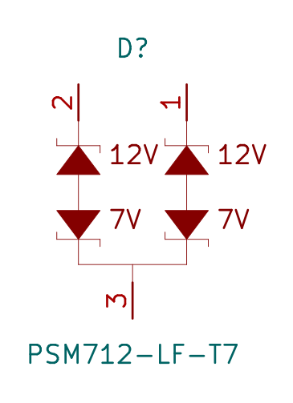

# YouEDA

Version 1.4.0: C2488 (MB10S) and C32677 (PSM712) now use composed symbol
layouts with 50-mil-grid connection points. Verified terminal roles, passive pin
types, Small strokes and the existing pad-enclosing courtyards are preserved.
KiCad also retains the composed bridge's polarity labels and PSM712's 12V/7V
branch annotations, with hidden pin names kept clear of the artwork.
Regenerate exported libraries to receive this correction; existing files are not
automatically migrated. See `docs/discrete-network-symbol-profiles.md`.

YouEDA is a Windows desktop component loader for EasyEDA/LCSC parts. Enter one LCSC code or paste/import a batch, inspect the symbol and footprint preview, then choose **Altium**, **KiCad**, or **Both** in the export-format selector.

## Download version 1.4.0

Download `YouEDA-1.4.0-win-x64.zip` from the [v1.4.0 release](https://github.com/youprint/YouEDA/releases/tag/v1.4.0). Install the [.NET 10 Desktop Runtime](https://dotnet.microsoft.com/download/dotnet/10.0) on Windows 10/11 x64, extract the complete ZIP, and run `YouEDA.exe`. Keep its DLLs, templates, and bundled symbol catalog together. The application is unsigned; verify the published SHA-256 checksum before use. The .NET 10 SDK is needed only to build from source.

Version 1.4.0 consolidates full CSV import, family libraries, shared download/cache scheduling, diagnostics, settings, price snapshots, and schematic/footprint quality corrections. See [release notes](docs/releases/1.4.0.md). Review the [current limitations](#kicad-exporter-smoke-test) and validate generated parts against their datasheets.

Altium output uses two native shared libraries:

- `youeda.PcbLib` — footprint, copper pads, silkscreen, and embedded STEP model when EasyEDA supplies one.
- `youeda.SchLib` — schematic symbol selected from the bundled common-symbol catalog, or generated from EasyEDA pin records for IC/MCU-class parts.

Each Altium footprint is named from EasyEDA's `packageDetail.title` (falling back to the LCSC number if no title is supplied), and the schematic symbol's native `PCBLIB` model link uses that same name. The schematic library uses a light sheet background and visible designator/comment labels; resistors and capacitors store the EasyEDA value as a hidden `Value` parameter referenced by the comment, while diodes use the manufacturer part number when available. Re-import an existing part to refresh these fields and rename an older LCSC-named footprint.

For a part without a suitable bundled schematic template, the EasyEDA fallback generates a framed symbol from its pin records. Pin names sit inside the body, pin numbers outside, and the designator and comment are placed above and below the frame.

Each import **upserts** the LCSC part number in the SchLib and its EasyEDA-named footprint in the PcbLib. Multiple LCSC parts with the same EasyEDA footprint title share one PcbLib entry; re-importing one refreshes that shared footprint.

KiCad output uses `youeda.kicad_sym`, `youeda.pretty/<LCSC>.kicad_mod`, and, when available, `youeda.3dshapes/<LCSC>.step`. The output folder also gets `sym-lib-table` and `fp-lib-table` if those files do not already exist. Re-importing a part replaces its symbol and footprint without disturbing other parts. Starting with 1.3.9, newly generated tables and STEP references use absolute installed-library paths, so a project can live elsewhere. Moving the library requires regenerating or relinking these paths; copying the folder alone does not make those links portable. Existing project tables are never overwritten by normal upserts.

### KiCad and pricing corrections included in 1.4

- Family output rewrites symbol-to-footprint links and gives each family its own nickname, such as `Capacitors:C107145`. Each family gets corrected tables; the timestamped run root also gets aggregate `sym-lib-table` and `fp-lib-table` files for all families. Add these entries to the consuming project's library tables (merge with existing entries; do not overwrite your project's tables). Do not register every family as `youeda`.
- Symbol units with a common offset from the 50-mil grid are translated rigidly, including all artwork and pins. Incompatible pin spacing is left unchanged and logged as `symbol.grid_review`. Native source libraries and the Altium geometry path are unchanged.
- Price selection uses the first available purchase tier, including when reading older cached snapshots. `JLCPCB Price Quantity` remains the per-piece basis `1`; `JLCPCB Price Tier Quantity`, MOQ and `JLCPCB Price Basis` disclose whether a single-piece offer exists or the value is a per-piece estimate at the minimum tier. An unqualified public offer is marked quantity-unverified.
- STEP file discovery is corrected, but source-coordinate placement defects remain under review. This build does not automatically centre models or certify 3D alignment.

> Validate every generated footprint, electrical pin mapping, and 3D model against the manufacturer datasheet before using it in production.

## Screenshots

The application images below are captures of the real 1.4 WPF interface from the
UI validation harness, using demonstration data and example output paths. Progress
figures illustrate the controls; they are not a performance benchmark.

### 1. Search, load a CSV, or run the complete import



Enter an LCSC reference for a single component, paste a list, or choose **Import CSV**.
**Run full import** performs lookup and export, producing combined and family-based
libraries without an organization prompt. Necessary symbol-review choices still apply.

### 2. Choose Altium or KiCad output



The bottom tabs select the exporter and destination. They are not library viewers.
The selected component's schematic and footprint previews remain in the importer.

### 3. Inspect a selected component



This validation fixture demonstrates both preview panes. Inspect the real component's
pins, package and datasheet before adding it to a production library.

### 4. Monitor conversion and downloads



Track average parts/minute, elapsed time, ETA, family-worker activity and shared 3D
downloads. Waiting for a model is distinguished from active conversion. The values
shown are simulated UI-test progress, not measured download speed.

### 5. Configure import, diagnostics and appearance



Settings groups CAD-cache refresh, Altium family-worker count, diagnostic logging and
appearance. Import options are locked during active jobs. Logs stay on the computer.

### 6. Three application themes

Graphite & Mint is shown above. Two additional full-interface themes are available:

<details>
<summary>Midnight Blueprint</summary>



</details>

<details>
<summary>Warm Studio</summary>



</details>

### 7. Corrected KiCad network symbols

These are KiCad-rendered exports, not UI mockups. Both use grid-aligned connection
points, passive pins, native diode artwork and preserved terminal functions.

| MB10S bridge — C2488 | PSM712 TVS array — C32677 |
| --- | --- |
|  |  |

MB10S retains positive, negative and two AC terminals. PSM712 retains IO1, IO2 and
GND internally, with separate voltage labels rather than misleading A1/A1/K text.

### 8. Altium footprint output


Earlier Altium output example: the component outline is on Top Overlay (yellow),
not a mid-layer. This image is retained as an output illustration, not a new 1.4
Altium GUI acceptance test.

## Features

- LCSC part lookup using the public EasyEDA component payload.
- Single-code, pasted-list, and CSV/text batch input.
- Dark WPF/MVVM desktop interface with symbol and footprint previews.
- Native Altium `PcbLib` writer using [OriginalCircuit.Altium (AltiumSharp)](https://github.com/issus/AltiumSharp).
- Top/bottom copper and Top/Bottom Overlay mapping, plated and SMD pads, and embedded EasyEDA STEP 3D bodies where available.
- Native KiCad symbol, footprint, and STEP-model output with shared-library upserts, project library tables, and multi-unit EasyEDA symbol support.
- Clear selected-row text and a separate export-format selector for Altium, KiCad, or both.
- Correct EasyEDA drill-radius-to-diameter conversion for both exporters; Altium slot metadata is preserved in its native size/shape block.
- Common parts use the bundled 71-symbol native Altium catalog (passives, diodes, crystals, connectors, sensors, transistors, LEDs, TVS/Zener, diode arrays and four-pin switches). An exact matching symbol in the user's `Desktop\Library` collection takes precedence over that catalog, including for multi-pin parts; EasyEDA pin-derived artwork is the final fallback. Ambiguous non-IC matches open a searchable picker with side-by-side previews of the EasyEDA-pin fallback and the currently selected bundled symbol.
- **Open in Altium** launches both `youeda.PcbLib` and `youeda.SchLib` through the Windows Altium file association.

## Build from source

### Prerequisites

- Windows 10/11.
- [.NET SDK 10](https://dotnet.microsoft.com/download/dotnet/10.0).
- Git.

The Altium writer is currently referenced from the upstream source tree because the required writer package is not available as a stable NuGet package.

```powershell
git clone git@github.com:youprint/YouEDA.git
cd YouEDA
git clone git@github.com:issus/AltiumSharp.git third_party/AltiumSharp
git -C third_party/AltiumSharp checkout ce72437f30cd54f549601d4e0ca5846d21272150
git -C third_party/AltiumSharp apply ../../patches/altium-native-symbol-coordinates.patch
git -C third_party/AltiumSharp apply ../../patches/altium-sdk-sourcelink.patch
dotnet restore .\src\EasyEdaAltiumGrabber.csproj
dotnet build .\src\EasyEdaAltiumGrabber.csproj -c Release
```

Run the development build:

```powershell
dotnet run --project .\src\EasyEdaAltiumGrabber.csproj -c Release
```

## GUI CSV/text batch import schema

The desktop app's **Import CSV** command accepts a lightweight list of LCSC references. A
reference must be an unquoted `C` followed by digits, for example `C11702`. References may be
separated by a newline, comma, semicolon, tab, or space; duplicates are removed automatically.
The safest format is one part number per row:

```csv
LCSC Part
C11702
C8678
C436585
```

The importer does not require a formal BOM schema. It ignores column headings and extra values,
so a quantity column is fine as long as the LCSC code remains unquoted:

```csv
LCSC Part,Quantity,Value,Description,JLCPCB Category,Notes
C11702,100,1kΩ,0402 resistor,Basic,
C8678,10,SS34,Schottky diode,Basic,
C436585,5,47uH,Power inductor,Basic,
```

Do not write a code as `"C11702"` in the GUI import file: the current lightweight parser accepts
plain `C11702` tokens. For large catalog reviews, retain the optional quantity, value, description,
JLCPCB category, and notes columns; YouEDA imports the part codes while those columns support
family, footprint, and schematic-symbol auditing.

### Price snapshots

During component lookup, YouEDA also attempts a non-blocking public LCSC/JLCPCB-supply-chain
price lookup. When available, its hidden schematic parameters contain the per-one-component unit
price (`JLCPCB Price Quantity = 1`), supplier minimum order quantity, price tiers, stock, source
URL, currency, and a UTC timestamp. This is a supplier-price snapshot, not a binding JLCPCB PCBA
quote; it can vary by tier, availability, account, and region. A failed price lookup never blocks
symbol or footprint import.

### Faster batch imports and live speed (1.2.36 and later)

- The desktop CAD lookup uses **3 concurrent workers**, with one shared start-rate gate
  (at most one new request per second, including retries). HTTP 429 and 5xx responses
  impose a shared cooldown; `Retry-After` seconds and HTTP dates are honored.
- Validated CAD payloads are reused for **7 days**. Enable **Refresh CAD from server**
  to bypass a fresh cache. An older validated payload remains a fallback when the server
  is unavailable. Cache files live in `%LocalAppData%\YouEDA\ComponentCache`.
- Two independent pricing workers run alongside CAD fetching. A slow price request does
  not occupy a CAD slot. Export becomes available only after both queues finish or are
  stopped and joined, so prices cannot mutate a component while its library is written.
- **Stop search — keep downloaded parts** cancels outstanding lookups and retains completed
  CAD results. Export them before starting another search: a new search replaces the visible
  results list. Searching the same list again reuses fresh downloaded CAD rather than
  downloading it again. This is cache reuse, not a GUI export-resume ledger.
- Conversion prefetches **up to 3 STEP/OBJ models concurrently**, with its own shared
  one-request-per-second start gate and provider-requested backoff. Model failures remain
  optional; schematic and footprint export can continue without a 3D model.
- Altium conversion keeps each destination library open in memory. A **single writer**
  adds components and saves/reopens verified checkpoints every **10 processed components**,
  before deferred symbol prompts, and at completion. A verified temporary sibling replaces
  each library file; the schematic/PCB pair is not a filesystem transaction. A crash can lose
  work since the last checkpoint. In 1.3, family mode uses one exclusive writer per family,
  followed by a single combined-library merge (see below). All modes use the same geometry and native
  symbol-selection logic. KiCad benefits from parallel model fetching but retains per-part saves.
- A **live speed indicator updates every second**, including during network waits. It shows
  average CAD/pricing throughput in parts/minute, processed counts, elapsed time, and an
  approximate ETA for each queue. Conversion shows its own throughput plus active/finished
  model downloads. ETA uses processed items (including failures), starts after a few samples,
  and can change during retries or slow responses. Conversion time excludes time spent
  waiting for a symbol-selection answer; queue completion is distinct from final file saving.

These limits improve overlap without issuing an uncontrolled burst. Actual speedup depends
on the provider, cache hits, model sizes, and disk speed; it is not guaranteed to be threefold.

### Large-batch family libraries

When **more than five resolved components** are manually exported, YouEDA offers one optional, one-time
choice: keep the normal combined library output, or also create a family-organized library run.
The normal choice remains the manual-export default. **Run full import** always selects family
output without prompting, regardless of batch size. Family mode retains `youeda.SchLib` / `youeda.PcbLib` (or
the KiCad equivalents) and additionally creates a timestamped, never-overwritten run below
`<output>\Family Libraries\YYYY-MM-DD_HHmmss\`. Each applicable family gets its own paired
library folder, for example `Resistors\Resistors.SchLib` and `Resistors\Resistors.PcbLib`.

Family assignment uses EasyEDA/LCSC tags, component type, description, package, manufacturer
metadata, and designator prefix. Categories are Resistors, Capacitors, Inductance (including
ferrites), Diodes (including LEDs/TVS/ESD), Transistors, IC, Crystal, Connectors,
Switches_Relays, and Other. Every part belongs to exactly one family. Low-confidence parts go to
`Other` without delaying the batch; `family-classification.csv` records the original LCSC `C…`
reference, assignment, confidence, and evidence.

`C:\Users\you38\Desktop\Library` is a read-only reference for the paired family-folder naming
convention. YouEDA rejects any export output path inside that folder and never overwrites, renames,
or modifies reference-library files.

### Parallel Altium family conversion (1.3.0)

Select **Altium family workers: 3** in **Settings…**, then use **Run full import** or manually
export more than five parts and choose **Create family-based library files**. Choose **1** for
the conservative serial fallback. The selector defaults to 3 for each app session; it does not
change normal shared-library export, KiCad export, or the CLI.

- Up to three whole families convert concurrently. Each owns separate in-memory libraries and
  output files; a worker takes the next family when finished. Larger families start first.
  A single-family job uses only one worker. Windows schedules the workers across available CPU
  cores; YouEDA does not pin workers to particular cores or launch separate app instances.
- All families share the same **three model-download slots** and provider pacing/backoff.
  CAD and pricing limits also remain unchanged. Three family workers do not create nine model
  downloads or triple the server request rate.
- Each family checkpoints every ten processed parts and at completion. Automatic components
  finish and save before any deferred symbol-selection prompts. A bad part is reported while
  subsequent parts continue; a failed checkpoint prevents publication of the combined libraries.
- After workers finish, one writer merges the verified family artifacts into `youeda.SchLib`
  and `youeda.PcbLib`. It preserves unrelated existing entries, native symbol artwork, pin
  mappings and line widths, footprint opt-outs, and embedded STEP references. Model-ID collisions
  are remapped instead of replacing an unrelated footprint's model. Duplicate footprint names
  use the last successful import item, with deferred-choice items processed after automatic ones.
- The live indicator shows active family workers, model downloads, throughput, and a separate
  final merge/verification phase. Completion is reported only after final files and audits exist.
- Completed family files use names such as `Resistors.SchLib` / `Resistors.PcbLib`. The run also
  contains `family-classification.csv`, `import-summary.json`, and `conversion-results.json`
  (worker count, successes, failures, elapsed time, and combined merge status).

Before replacing the combined files, YouEDA verifies both staged libraries and copies any
previous combined files to `<family run>\Previous combined libraries\<unique id>\`.
If the second file cannot be replaced, it attempts to restore the first. This is **not** a
power-failure-atomic two-file transaction. On failure, retain the family run and its backups;
there is no automatic GUI export-resume/recovery ledger. Unfinished family checkpoints use the
internal `youeda.*` names until successful completion. Do not run two exports to the same output
directory simultaneously. The original `Desktop\Library` reference remains read-only.

Validation includes concurrency bounds, cancellation/joining, checkpoint failures, locked-target
rollback, model-ID collisions, repeat merges, symbol-only output, and one/three-worker equivalence.
The optional offline acceptance command reads the supplied 351-part CSV and existing raw CAD cache,
writes only a **new** test output directory, and compares generated symbols/footprints:

```powershell
dotnet run --project tests/KiCadSmoke/KiCadSmoke.csproj -- --validate-cached-families <csv-path> <cache-directory> <new-test-output>
```

This acceptance test deliberately omits model downloads and interactive symbol choices; it measures
local conversion, not end-to-end import speed. Model payload/placement preservation is tested with
separate controlled fixtures. Server waits, disk contention, and uneven family sizes can limit the
benefit of parallel conversion.

### Automatic EasyEDA regulator choice (1.3.7 test build)

The same build also automatically reuses the native **Optoisolator** for C109227/LTV-817S-TA1-C
and C115450/LTV-217-B-G, with verified LED anode/cathode and transistor emitter/collector
mapping (1/2/3/4). It uses native crystal artwork for two-terminal passive quartz devices and
four-terminal quartz devices with explicit OSC1/OSC2 plus two GND terminals. Source numbers
are bound by function, not package. Active oscillators, unknown four-pin topologies and
conflicting optocoupler identities remain reviewable; native Small artwork is preserved.
See [native common symbol rules and evidence](docs/native-common-symbols.md).

C16133/TAJB107K006RNJ and C7171/TAJA106K016RNJ also automatically use the native
**Polarised Capacitor**. Reviewed source artwork confirms pin 1 positive, pin 2 negative.
Unknown numeric-only tantalums and contradictory polarity are not guessed.

LDOs/voltage regulators identified by category/type metadata now automatically use the
existing EasyEDA option without a symbol-picker prompt, in both normal and family imports.
Descriptions beginning with an explicit regulator type are also recognised; package names
and pin names alone are not evidence. This source preference takes priority over automatic
native matching; a manually supplied symbol override still takes priority over the preference.

The seven confirmed selections are retained even with sparse metadata: C14289 (HT7533-1),
C5446 (XC6206P332MR), C58069 (L78M05ABDT-TR), C6186 (AMS1117-3.3), C6187 (AMS1117-5.0),
C71136 (78L05G-AB3-R), and C3113 (CJ431). CJ431 is an explicit voltage-reference exception.
Other voltage references and unrelated picker decisions are unchanged.

“EasyEDA” currently means a readable generated body using EasyEDA's pin data, not a faithful
copy of the original drawing primitives. Original terminal numbers/names, including tab pins,
remain intact. Diagnostics record `symbol.easyeda_preference` with the part and selection reason.

### Discrete-symbol corrections (1.3.6 test build; Altium visual acceptance pending)

The reported MB10S bridge, BAV99 series pair, BAV70 common-cathode pair, P6SMB6.8CA and
SMBJ6.5CA bidirectional TVS, PSM712 asymmetric protection array, and TS-1187 four-pin switch
now have exact-identity topology profiles. They reuse native artwork, with documented network
composition where no complete matching native symbol exists. Four-pin switch artwork from
the source collection expands the catalog to 71. All physical pins remain, Small strokes are
used, and unknown variants still require review. See [network evidence and topology tests](docs/discrete-network-symbol-profiles.md).

Single transistors now use polarity-aware native-template selection and functional pin
binding. This addresses rectangular fallbacks for AO3400A, AO3401A, SI2301CDS-T1-GE3,
2N7002, S8550 and D882, and prevents PNP parts from receiving NPN artwork merely because
B/C/E numbers match. Small line width is retained. The PNP drawing is an explicitly
documented emitter-arrow variant of the native NPN template, because the supplied BJT
SchLib collection contains no PNP record. Existing reference libraries remain unchanged.

See [transistor profile evidence and tests](docs/transistor-symbol-profiles.md).
Ambiguous or conflicting transistor metadata still requires review; no arbitrary
three-pin template is selected. PCB/3D positioning is unchanged in this test build.

### Diode and ferrite corrections (1.3.5 test build; Altium visual acceptance pending)

- Two-terminal diodes with explicit A/K, Anode/Cathode, A/C or +/- source pin functions reuse
  native artwork with a checked per-part polarity binding. This preserves reversed pin-number
  conventions instead of emitting the generic rectangular fallback. The common native Diode,
  LED and Diode Zener drawings are distinct; Schottky parts reuse the reviewed
  `SS34_C52023881` drawing from the supplied personal Diodes.SchLib (when available).
- Native source files and cached catalog instances are unchanged. Only each independent output
  copy receives the source pin numbers and A/K function names; native geometry and widths remain.
  Donor-specific ratings, supplier parameters and simulation/footprint models are discarded from
  the artwork copy before applying the imported component's own metadata and footprint.
  Source pin-function agreement is not a substitute for datasheet certification. Unknown roles,
  multi-pin arrays, bridges and TVS variants still require review rather than a guessed mapping.
- Ferrite beads keep the native Ferrite Chip artwork and are described as **Ferrite bead**, not
  Inductor just because their designator begins with L. Ordinary inductors retain their coils.
- The review picker now understands the same combined directory/catalog path as automatic
  matching. Missing choices report an error instead of silently choosing a rectangle. Diagnostics
  distinguish `symbol.picker_shown`, `symbol.picker_result`, `symbol.picker_unavailable`, and
  `symbol.diode_binding` from scheduling a review.

### Symbol-quality checks (introduced in 1.3.4; Altium visual acceptance pending)

Automatic native selection checks component identity and numbered terminals. Package names do not
identify an electrical symbol; a matching multi-symbol library filename does not authorize taking
its first record. Known anode/cathode and transistor pin-function conflicts are rejected. Generic
polarized/function-specific matches need recognised pin functions; uncertain choices remain deferred.
The symbol picker explains terminal incompatibility and disables an incompatible selection. Export
also checks the selected symbol before writing library data. These are compatibility checks, not
a substitute for datasheet verification of every pin.

Native inductor elliptical arcs and core bars are retained, including **Small** line width.
SchLib vertex coordinates now use native DXP units with fractional coordinates; the preview-only
100x scale correction is removed. Generated ordinary inductors must have exactly two terminals and
their coil endpoints meet the pin body ends. Ferrite-bead metadata selects the compatible native
ferrite symbol instead of an ordinary coil. Coupled and multi-terminal devices are not reduced to
two pins. KiCad output retains native elliptical coils as sampled curves.

Read-only source audit, writing a new JSON report:

```powershell
dotnet run --project tests/KiCadSmoke/KiCadSmoke.csproj -- --audit-symbol-quality <351-part-csv> <cache-directory> <new-report.json>
```

The report lists per-part decisions, selected source, pin checks and symbol/footprint terminal
differences. NC, mechanical and repeated terminals can be legitimate; flagged differences require
review. No network requests or source-library edits occur. Validate new schematic output in a fresh
test directory and compare in Altium before replacing an existing working library.

### Dependency scheduling, shared assets, diagnostics, and full import (1.3.1)

**Settings (1.3.2):** use **Settings…** beside Search for CAD refresh, Altium family-worker
count, diagnostic logging/Open logs, and appearance. The batch panel keeps a compact summary,
including a warning when server refresh bypasses the cache. Per-part footprint/3D checkboxes
remain in the results table. Changes apply immediately; import options are locked during a job.
Appearance and diagnostic logging are saved; refresh starts off and workers reset to 3 at launch.
The Altium/KiCad viewer tabs and their dedicated loaders have been removed from the project.
Both export formats, native symbol-picker rendering, and main-importer component previews remain.

**Hover help (1.3.3):** tooltips use matching theme colours and wrap long descriptions. This fixes
the pale, almost blank rectangle caused by light tooltip text on the Windows default light surface
in dark themes. The pointer behavior and import/export pipeline are unchanged.

**Run full import:** load the CSV with **Import CSV**, select the Altium/KiCad output folder,
then click **Run full import**. It waits for CAD and pricing workers to join, automatically starts
library generation, and finishes with file verification/merge. Available footprints and models
are included by default; existing per-part checkbox choices are preserved for matching LCSC IDs.
Since **1.3.2**, full import always creates family-based libraries in addition to the combined
library, with **no organization prompt**, including batches of five or fewer components.
Separate manual export actions still offer the organization choice for more than five components
and keep normal output for smaller batches. Necessary deferred symbol questions still apply.
Stopping search or getting no usable parts prevents automatic export; partial successful lookups
can proceed and lookup failures remain in the log. Separate Search/export buttons remain available.
The chosen format/output are captured at start; overlapping full imports are disabled.

**Scheduling:** active family workers advertise their current model and two-part look-ahead.
When a download slot becomes free, current dependencies across active families take precedence
over look-ahead, then remaining work follows CSV order. In-flight downloads are never restarted.
The three-slot limit and shared one-request-per-second STEP/OBJ gate stay unchanged. The progress
display distinguishes **converting**, **waiting for 3D**, and **saving** rather than treating an
assigned family job as a busy CPU core.

**Reuse:** a repeated footprint such as `R0402` is built once per output writer when geometry and
model placement match; real coordinate/width/model changes rebuild it. Every LCSC symbol and its
parameters are still written. Repeated model UUIDs share one STEP/OBJ job across the whole batch,
but each part keeps its own model position/rotation. Model names alone are not used to merge
different UUIDs. Native artwork and line-size enums are unchanged.

Validated STEP payloads and OBJ bounds are also cached for **7 days** in
`%LocalAppData%\YouEDA\ModelCache`. Cache entries use UUID keys, schema checks, a complete STEP
envelope, and SHA-256 payload validation. Expired/corrupt entries refresh automatically; a missing
STEP is not negatively cached. If only OBJ bounds were unavailable, the next attempt reuses STEP
and retries OBJ. Cache write failure never blocks a usable model. **Refresh CAD from server**
controls CAD only, not this model cache. Each per-part CAD payload contains symbol and footprint
data together, so uncached CAD still requires its own component request; existing CAD cache reuse
is unchanged. Unique-model counts and reused parts are recorded in diagnostics.

**Generate diagnostic logs:** opt in through **Settings…** before Search or Run full import. The preference is saved
and takes effect at the next phase start. Use **Open logs** to find timestamped `.jsonl` files in
`%LocalAppData%\YouEDA\Logs`. Full imports have a parent log plus linked lookup/export logs;
ordinary lookup and export logs are linked by the prior lookup path. The UI confirms recording,
saved, or unavailable status; hover that status for the most recent file path.

Logs include version/settings, LCSC IDs, source/output paths, cache hits, model reuse and priority,
request status codes, rate-limit waits, retry/backoff delays, parsing/resolution/export timings,
family state changes, checkpoints, merge/publication/rollback, and failure types/stack locations.
Every **5 seconds**, a heartbeat lists unfinished timed operations and their elapsed duration,
including network/model waits. A started operation with no end event can identify where an
interrupted/crashed run stopped. `operation.end` means the scope ended, not necessarily success;
check the result/failure event too. Files flush as events are written and logging failure is
non-fatal. Raw CAD/STEP content, HTTP headers, credentials, and arbitrary exception response bodies
are excluded. Logs are local only and never uploaded automatically. They do contain part IDs and
local filesystem paths: review them before sharing. Old logs are retained until you remove them.

The 1.3.1 tests cover artificially delayed downloads, cross-family dependency priority, exactly-once
model fetching, shared-payload pose preservation, cache integrity/expiry/failure, live diagnostic
heartbeats, concurrent JSON-lines writes, footprint reuse/invalidation, and full-import sequencing.
These tests do not establish live-server throughput. Around 28–29 parts/minute with two fresh
requests per model is consistent with the existing request gate; reuse can remove redundant
requests without increasing server pressure. Measure final end-to-end time before claiming 60+.

## CLI status

The current `YouEDA.Cli` entry point supports only the native common-catalog maintenance command:

```powershell
dotnet run --project .\src\YouEDA.Cli\YouEDA.Cli.csproj -- --write-common-catalog-from-directory <source-directory> <destination.SchLib>
```

Although it links shared import/export services, component-list importing, agent-oriented JSON
output, and resume commands are not currently exposed by its entry point. Earlier bulk-import
examples did not match the current implementation. Agent-facing CLI work is deferred while the
desktop importer is stabilized; use the desktop app for component imports.

## Publish a Windows build

Create a framework-dependent folder matching the v1.4.0 release package (use a serviced .NET 10 SDK):

```powershell
dotnet publish .\src\EasyEdaAltiumGrabber.csproj -c Release -r win-x64 --self-contained false -o .\dist\YouEDA
```

Copy the complete `dist\YouEDA` folder to the target computer. Do not copy only `YouEDA.exe`: the DLLs, native dependencies, templates, and bundled symbols beside it are required. Install the .NET 10 Desktop Runtime on that computer.

To package the same layout as the release download:

```powershell
Compress-Archive -Path .\dist\YouEDA\* -DestinationPath .\dist\YouEDA-1.4.0-win-x64.zip
```

## Install and first use

1. Extract/copy the published `YouEDA` folder to a permanent location, for example `C:\Apps\YouEDA`.
2. Run `YouEDA.exe`. Windows may show a SmartScreen warning for an unsigned local build; review the source/release and follow your organization’s policy.
3. Choose an output directory, such as `C:\Users\<you>\Documents\YouEDA-Libraries`.
4. Search an LCSC part number (`C12345`), select the footprint/3D rows to add, and choose **Add selected to library**.
5. Use **Open in Altium** to load the shared `youeda.PcbLib` and `youeda.SchLib` files in Altium Designer. If a library is already open and locked in Altium, close it before updating it in YouEDA.
6. For KiCad output, create or open a KiCad project in the output folder. KiCad reads the generated `sym-lib-table` and `fp-lib-table`; select the `youeda` library in the symbol and footprint choosers.
7. Inspect the imported footprint, symbol polarity/pin mapping, model orientation, and manufacturer datasheet before release.

## KiCad exporter smoke test

The local **1.3.8 KiCad-quality test build** corrects the conversion issues described
below. It is not a mechanical sign-off: some cached EasyEDA model origins remain
displaced and must be reviewed before relying on their 3D placement.

The repository includes an offline test for EasyEDA parsing, multi-unit symbols, KiCad upsert, 3D paths, Altium drilled-pad round-tripping, native schematic labels/footprint links, and rendered symbol previews for resistor, capacitor, and diode examples:

```powershell
dotnet run --project .\tests\KiCadSmoke\KiCadSmoke.csproj
```

If KiCad CLI is installed, you can also ask KiCad itself to render the generated symbol and footprint from the test's `smoke-output` folder using `kicad-cli sym export svg` and `kicad-cli fp export svg`. The desktop exporter does not require KiCad or Python at runtime. The bulk CLI remains Altium-only for now.

The KiCad quality corrections cover native wire-tip pin anchors, EasyEDA pin direction and electrical types, pad angles, footprint arcs, conservative pad-enclosing courtyards, geometry-based reference/value placement, native Small strokes and available source/price metadata. See [KiCad quality validation](docs/kicad-quality-validation.md) for regression checks and the offline 351-part acceptance workflow.

The exporter handles common pads, drilled/slot pads, tracks, rectangles, circles, holes, footprint arcs, STEP references and schematic pins/graphics. EasyEDA `VIA`, `TEXT`, complex schematic SVG curves and some region/cutout semantics are not yet translated. Source silkscreen may still cross copper. Missing source datasheets remain empty. STEP coordinate conventions are corrected, but stale/displaced source model origins and model-specific lead orientation still require review; the exporter does not blindly centre models or claim datasheet-certified electrical/mechanical correctness.

## Bundled symbol catalog

`src\Assets\BundledUserSymbols.SchLib` is included with this repository and is copied into the application during build/publish. It provides 71 common native-component symbols, rebuilt from the user's Altium source collection. YouEDA resolves an exact component in `Desktop\Library` first, then uses this catalog only when its family and pin mapping are safe, and finally generates the EasyEDA symbol if neither is suitable. If you distribute a modified catalog, ensure that you have permission to redistribute its artwork and pin definitions.

```text
src\Assets\BundledUserSymbols.SchLib
```

## Third-party notices

- [OriginalCircuit.Altium / AltiumSharp](https://github.com/issus/AltiumSharp), Apache-2.0. It provides the native Altium file reader/writer used by YouEDA.
- [easyeda2kicad.py](https://github.com/uPesy/easyeda2kicad.py), AGPL-3.0, was consulted as an EasyEDA/KiCad format reference; its Python source is not bundled or copied into YouEDA.
- EasyEDA/LCSC data is fetched from public web endpoints. Endpoint formats can change without notice.

YouEDA is an independent desktop tool; it is not affiliated with Altium, EasyEDA, JLCPCB, or LCSC.
